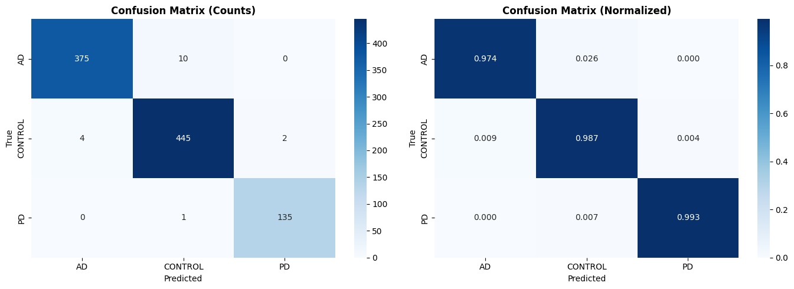
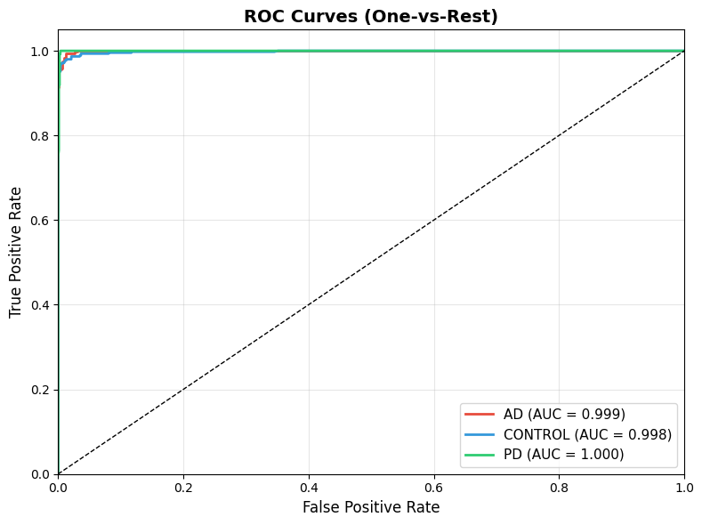

# 🧠 HybridDualPathNet – Brain MRI Disease Classifier

🚀 A hybrid AI architecture for medical image classification combining **EfficientNetV2-S** + **Swin-Tiny** with cross-attention fusion.

Classifies brain MRI scans into:
- **Alzheimer's Disease (AD)**
- **Parkinson's Disease (PD)**
- **Healthy Control**

Achieved **98.46% test accuracy** · **0.9981 macro AUC-ROC** with Grad-CAM++ explainability.

---

## 🔍 Overview

**HybridDualPathNet** combines CNN local features and Transformer global context via **Cross-Fusion Attention**, with **7-pass Test-Time Augmentation** and **Grad-CAM++** heatmaps for clinical interpretability.

This repository includes:
1. **Training notebook** — full PyTorch training pipeline
2. **Django web app** (`web/`) — production-ready deployment with Celery, PostgreSQL, Render/Railway support
3. **Results & visualizations** — confusion matrix, ROC, Grad-CAM outputs

---

## 🧠 Model Architecture

* EfficientNetV2-S (Local spatial feature extraction)
* Swin-Tiny Transformer (Global contextual features)
* Cross-Fusion Attention Module
* Focal Loss + Label Smoothing
* OneCycle Learning Rate Scheduler
* Test-Time Augmentation (TTA)
* Grad-CAM++ explainability

---

## 📂 Project Structure

```
HybridDualNetPath/
├── notebook/          # Training notebooks (Colab)
├── outputs/           # Result plots & metrics
├── docs/              # Research paper
├── scripts/           # Utility scripts (push, Colab export)
├── web/               # Django web application
├── requirements.txt   # Notebook dependencies
├── PROJECT_STRUCTURE.md
└── README.md
```

See **[PROJECT_STRUCTURE.md](PROJECT_STRUCTURE.md)** for the full folder tree.

---

## 🌐 Django Web App

Full-stack brain MRI classifier with modern UI, user accounts, async inference, and explainability.

### Quick Start

```bash
cd web
python -m venv .venv
source .venv/bin/activate          # Windows: .venv\Scripts\activate
pip install -r requirements.txt --extra-index-url https://download.pytorch.org/whl/cpu

cp .env.example .env
python download_model.py           # Downloads weights from Google Drive
python manage.py migrate
python manage.py createsuperuser
python manage.py runserver
```

Open **http://127.0.0.1:8000** — sign up, upload MRI, view Grad-CAM++ results.

### Verify Setup

```bash
python manage.py check_setup
```

See `web/README.md` for Render/Railway deployment.

---

## ▶️ Training (Notebook)

```bash
git clone https://github.com/Jarpula-Nirjala/HybridDualNetPath.git
cd HybridDualNetPath
pip install -r requirements.txt
```

Open `notebook/NIRJALA_13.ipynb` or `notebook/IIITSURAT_MAJOR_PROJECT_UI22EC34.ipynb` in Google Colab.

---

## 📥 Model Download

Trained weights (~195 MB) are hosted on Google Drive (too large for GitHub):

👉 **[Download Trained Model](https://drive.google.com/file/d/1rDF-vTOgMSIrpE3rV1OXukyhXiVNxxRq/view?usp=sharing)**

For the web app, either:
- Run `python web/download_model.py` (auto-download), or
- Copy manually to `web/weights/final_model.pth`

---

## ⚠️ Dataset

Dataset not included due to size.

👉 **[Download Dataset](https://drive.google.com/file/d/1AnHbNwv5rBtxYwCBDUwXS_dIGAs2FX1F/view?usp=sharing)**

---

## 📊 Model Performance

| Metric | Value |
|--------|-------|
| Test Accuracy (TTA) | 98.46% |
| Macro AUC-ROC | 0.9981 |
| F1 — AD | 0.982 |
| F1 — Control | 0.981 |
| F1 — PD | 0.998 |

---

## 📸 Results







---

## 🛠 Tech Stack

| ML | Web |
|----|-----|
| PyTorch, timm | Django 5, DRF |
| EfficientNetV2-S | Celery + Redis |
| Swin-Tiny | PostgreSQL |
| Grad-CAM++ | Bootstrap 5, HTMX |
| Albumentations | WhiteNoise, Gunicorn |

---

## ✨ Author

**Jarpula Nirjala (JARPULANIRJALA)**  
📧 [nirjala8462@gmail.com](mailto:nirjala8462@gmail.com)  
📱 +91 7842849340  
🔗 [LinkedIn](https://www.linkedin.com/in/nirjala-jarpula-749346321/) · [GitHub](https://github.com/Jarpula-Nirjala)  
🎓 IIIT Surat · B.Tech ECE · 2022–2026

---

## ⭐ Support

If you find this project useful, give it a ⭐ on GitHub!

> **Disclaimer:** Research and educational use only. Not a medical device.
# HybridDualPathNet
